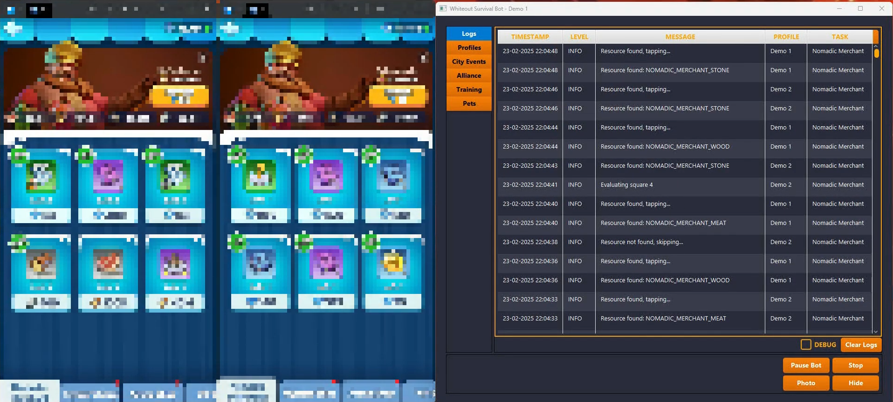
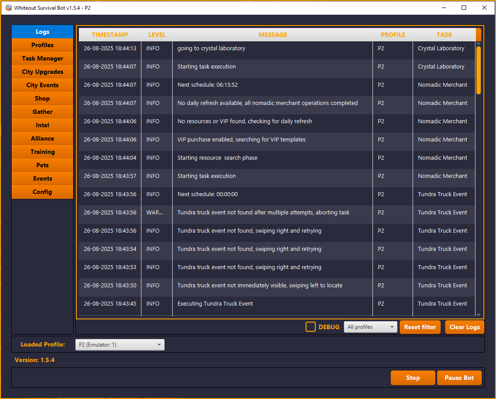
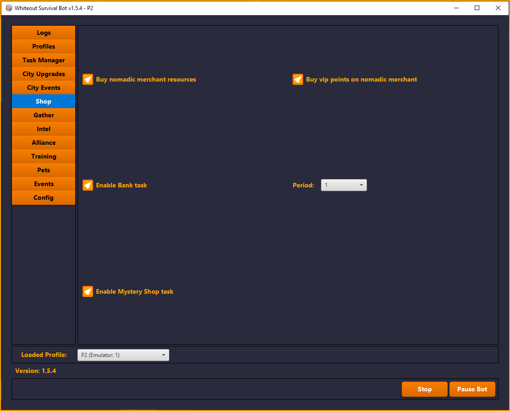
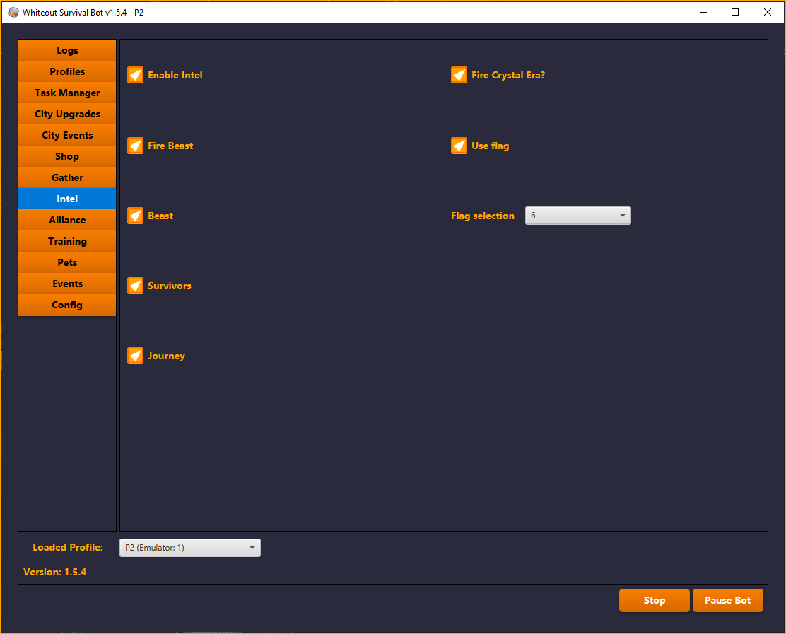
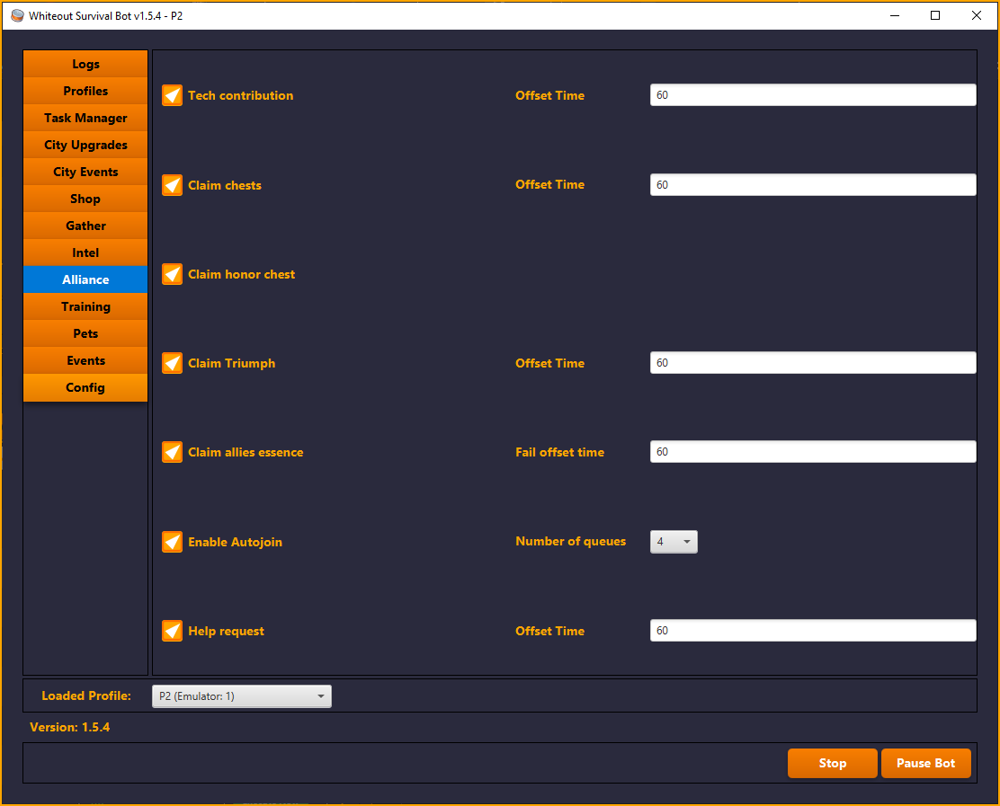

# Whiteout Survival Bot

[](https://buymeacoffee.com/cearivera1z)
[](https://discord.gg/Wk6YSr6mUp)

> **⚠️ Project Status: Paused** - The development of this project is currently on hold due to personal matters.

A bot for automating tasks in **Whiteout Survival**. This project is a work in progress and is developed in my free time. If you have any requests or suggestions, feel free to ask. I will try to respond as soon as possible.

---

## 📌 Current Features

- ✅ Multi-profile support (run multiple accounts simultaneously)
- ✅ Automates daily **Nomadic Merchant** interactions
- ✅ Automatically buys **VIP points** from the merchant
- ✅ **Hero Recruitment** automation
- ✅ Collects **Daily Shards** from the **War Academy**
- ✅ Collects **Fire Crystals** from the **Crystal Laboratory**
- ✅ Opens **Exploration Chests**
- ✅ Claims **Daily VIP Points**
- ✅ Contributes to **Alliance Tech**
- ✅ Collects **Alliance Chests**
- ✅ Auto **Trains and Promotes Troops**
- ✅ Auto activates **Pet Skills** (Food, Treasure and Stamina)
- ✅ Claims **Online Rewards**
- ✅ Claims **Pet Adventure** chests
- ✅ Auto-collect rewards from mail
- ✅ **Alliance Auto Join** for rallies
- ✅ Automatically **Gathers** resources
- ✅ Automate **Intel** completion
- ✅ Claims **Tundra Trek Supplies**
- ✅ Automates **Tundra Truck Event** "My Trucks" section

---
## 🎬 Video Showcase

[](https://www.youtube.com/watch?v=Nnjv68xiIV0)

---

## 📸 Screenshots

| | | |
|:----------------------------------------------------------:|:----------------------------------------------------------:|:----------------------------------------------------------:|
|  |  |
|  |  | 
|  |  |
|  |  |
|  |  |
|  |  |
|  |

---

## ⚙️ Configuration

The bot is designed to run on **MuMu Player** with the following settings:

- **Resolution:** 720x1280 (320 DPI)  
- **CPU:** 2 Cores  
- **RAM:** 2GB 
- **Language:** English

---

## 🛠️ How to Compile & Run

### To Compile:

```sh
mvn clean install package
```
This will generate a `.jar` file in the `wos-hmi/target` directory.

### To Run:

#### From the Command Line (Recommended)
Running from the command line allows you to see real-time logs, which is helpful for debugging.
```sh
# Navigate to the target directory and run the bot
java -jar wos-bot-x.x.x.jar
```

#### With a Double-Click
You can also run the bot by double-clicking the `wos-bot-x.x.x.jar` file. Note that this will not display a console for logs.

---

### 🚀 Future Features (Planned)
- 🔹 **Arena Battles** – Manage arena battles automatically.
- 🔹 **Beast Hunt** – Implement automatic beast hunting.
- 🔹 **Polar Terror Hunt** – Implement automatic polar terror hunting.
- 🔹 **And more...** 🔥


